# Generador Seguro de Contraseñas — Backend API REST


## Link video diagramas (caso de uso, arquitectura) -> : https://youtu.be/iqpLPiiygMQ
## Link del video explicativo backend-> : https://youtu.be/eESbm-bW77s
## Link del video explicativo frontend final -> : https://youtu.be/2M_n3D7lL0A

## Descripción

Backend API REST para generar contraseñas seguras utilizando **Cryptographically Secure Pseudo-Random Number Generator (CSPRNG)**. El sistema implementa cálculo de entropía según estándares NIST SP 800-63B y RFC 4086, con validación de fortaleza integrada.

### Características principales

- ✅ **CSPRNG genuino**: Generación criptográfica con `secrets.choice()` (no `Math.random`)
- ✅ **Cálculo de entropía**: Formula de Shannon: H = L × log₂(N)
- ✅ **Rate limiting**: Máximo 30 solicitudes/minuto por IP
- ✅ **CORS configurado**: Lista blanca de orígenes permitidos
- ✅ **Security headers**: Cabeceras HTTP de defensa en profundidad
- ✅ **Validación Pydantic**: Tipado fuerte y validación automática
- ✅ **Documentación interactiva**: Swagger UI integrado
- ✅ **Logging seguro**: Registra metadatos, nunca contraseñas

---

## Requisitos previos

- **Python** 3.11 o superior
- **pip** (gestor de paquetes)
- Conexión a internet (para instalar dependencias)

### Verificar versión de Python

```bash
python --version
```

Si tienes múltiples versiones:
```bash
python3.11 --version
```

---

## Instalación

### 1. Descargar archivos

Descarga estos 5 archivos en una carpeta llamada `backend/`:

```
backend/
├── main.py              # Punto de entrada, servidor FastAPI
├── models.py            # Esquemas Pydantic (Request/Response)
├── security.py          # Motor criptográfico + validador de fuerza
├── config.py            # Configuración centralizada
└── requirements.txt     # Dependencias
```

### 2. Instalar dependencias

En la carpeta `backend/`, abre la terminal y ejecuta:

```bash
pip install -r requirements.txt
```

**Salida esperada:**
```
Successfully installed FastAPI-0.109.0 Uvicorn-0.27.0 Pydantic-2.6.1 ...
```

### 3. Verificar instalación

```bash
pip list | grep -E "FastAPI|Pydantic|Uvicorn"
```

Deberías ver las 5 librerías listadas.

---

## Ejecutar el servidor

En la carpeta `backend/`, ejecuta:

```bash
python main.py
```

**Salida esperada:**
```
INFO:     Iniciando Generador Seguro de Contraseñas (v1.0.0) en modo development
INFO:     CORS permitido desde: ['http://localhost', 'http://localhost:3000', ...]
INFO:     Rate limit: 30/minute
INFO:     Servidor escuchando en http://127.0.0.1:8000
INFO:     Uvicorn running on http://127.0.0.1:8000 (Press CTRL+C to quit)
```

La terminal **permanecerá activa**. Para detener, presiona `CTRL + C`.

---

## API Endpoints

### Health Check

```http
GET /health
```

**Respuesta (200 OK):**
```json
{
  "status": "healthy",
  "version": "1.0.0"
}
```

---

### Generar contraseña segura

```http
POST /api/v1/password
Content-Type: application/json

{
  "length": 20,
  "useUppercase": true,
  "useLowercase": true,
  "useDigits": true,
  "useSymbols": true,
  "excludeAmbiguous": false
}
```

**Parámetros:**

| Parámetro | Tipo | Por defecto | Rango | Descripción |
|---|---|---|---|---|
| `length` | Integer | 16 | 8-128 | Longitud de la contraseña |
| `useUppercase` | Boolean | true | - | Incluir mayúsculas (A-Z) |
| `useLowercase` | Boolean | true | - | Incluir minúsculas (a-z) |
| `useDigits` | Boolean | true | - | Incluir dígitos (0-9) |
| `useSymbols` | Boolean | true | - | Incluir símbolos especiales |
| `excludeAmbiguous` | Boolean | false | - | Excluir caracteres ambiguos (i, l, 1, o, 0, O) |

**Respuesta (200 OK):**
```json
{
  "password": "k7$Wm2#qPxR9!nL4vB&t",
  "length": 20,
  "entropyBits": 131.1,
  "strength": "very_strong",
  "alphabetSize": 94
}
```

**Códigos de error:**

| Código | Descripción |
|---|---|
| 400 | Parámetros inválidos (ej. longitud fuera de rango) |
| 429 | Límite de tasa excedido (máximo 30 por minuto) |
| 500 | Error interno del servidor |

---

## Probar la API

### Opción 1: Swagger UI (Recomendado)

1. Abre tu navegador en: `http://localhost:8000/api/docs`
2. Busca el endpoint `POST /api/v1/password`
3. Haz clic en **"Try it out"**
4. Edita los parámetros JSON (o déjalos por defecto)
5. Haz clic en **"Execute"**
6. Ver respuesta

### Opción 2: cURL (Terminal/PowerShell)

```bash
curl -X POST "http://localhost:8000/api/v1/password" \
  -H "Content-Type: application/json" \
  -d '{
    "length": 20,
    "useUppercase": true,
    "useLowercase": true,
    "useDigits": true,
    "useSymbols": true,
    "excludeAmbiguous": false
  }'
```

### Opción 3: Python (requests)

```python
import requests

response = requests.post(
    "http://localhost:8000/api/v1/password",
    json={
        "length": 20,
        "useUppercase": True,
        "useLowercase": True,
        "useDigits": True,
        "useSymbols": True,
        "excludeAmbiguous": False
    }
)

print(response.json())
```

---

## Seguridad

### Generación criptográfica

El sistema utiliza **`secrets.choice()`** que implementa un CSPRNG (Cryptographically Secure Pseudo-Random Number Generator):

- **Fuente de entropía (Linux/macOS):** `/dev/urandom`
- **Fuente de entropía (Windows):** `CryptGenRandom`
- **Jamás usa `Math.random()`:** No es criptográfico (predecible)

### Cálculo de entropía

La fortaleza de cada contraseña se calcula usando la fórmula de entropía de Shannon:

```
H = L × log₂(N)

Donde:
  L = longitud de la contraseña
  N = tamaño del alfabeto utilizado
```

### Clasificación de fortaleza

| Rango (bits) | Clasificación | Tiempo estimado para crackear* |
|---|---|---|
| < 28 | `very_weak` | Segundos |
| 28-35 | `weak` | Minutos |
| 36-59 | `reasonable` | Horas a días |
| 60-127 | `strong` | Años a siglos |
| ≥ 128 | `very_strong` | Infactible |

*Asumiendo 10¹² intentos/segundo (GPU moderna, hash débil)

### Medidas de defensa

- **HTTPS/TLS 1.3** (recomendado en producción)
- **CORS restrictivo** (solo orígenes permitidos)
- **Rate limiting** (30 solicitudes/minuto)
- **Security headers** (Cache-Control, X-Frame-Options, HSTS)
- **Validación Pydantic** (entrada tipada y validada)
- **Logging seguro** (nunca registra contraseñas)

---

## Estructura del proyecto

```
backend/
├── main.py
│   ├── FastAPI app configuration
│   ├── CORS middleware
│   ├── Rate limiting
│   ├── Security headers
│   ├── Endpoints: GET /, GET /health, POST /api/v1/password
│   └── Uvicorn server startup
│
├── config.py
│   ├── CORS_ORIGINS (lista blanca)
│   ├── RATE_LIMIT (30/minute)
│   ├── PASSWORD_*_LENGTH (8-128)
│   ├── ALPHABETS (mayús, minús, dígitos, símbolos)
│   ├── STRENGTH_THRESHOLDS (clasificación)
│   └── setup_logging() (archivo rotativo)
│
├── models.py
│   ├── PasswordRequest (Pydantic model entrada)
│   ├── PasswordResponse (Pydantic model salida)
│   └── ErrorResponse (Pydantic model errores)
│
├── security.py
│   ├── PasswordGenerator.build_alphabet()
│   ├── PasswordGenerator.generate()
│   ├── PasswordStrengthValidator.calculate_entropy()
│   ├── PasswordStrengthValidator.classify_strength()
│   └── PasswordStrengthValidator.validate()
│
├── requirements.txt
│   └── FastAPI, Uvicorn, Pydantic, slowapi, python-multipart
│
└── logs/
    └── password_generator.log (creado automáticamente)
```

---

## Flujo de ejecución

```mermaid
    flowchart TD
    INICIO([Inicio: Usuario abre la aplicacion])
    UI["Renderizar interfaz de usuario<br/>- Input de longitud<br/>- Checkboxes de tipos de caracteres<br/>- Botones de generacion y copiar"]
    INPUT["Usuario ingresa parametros<br/>- Longitud deseada<br/>- Tipos de caracteres: mayusculas, minusculas, digitos, simbolos"]
    VALIDA_FE{Validacion Frontend<br/>parametros correctos?}
    ERROR_FE["Mostrar error en UI:<br/>Longitud entre 8 y 128"]
    HTTPREQ["Enviar solicitud HTTPS POST<br/>a /api/v1/password<br/>Body: JSON con parametros"]
    VALIDA_BE{Validacion Backend<br/>schema Pydantic OK?}
    ERROR_BE["Responder 400 Bad Request<br/>con mensaje de error"]
    GENERA["Motor Criptografico<br/>secrets.choice sobre alfabeto<br/>para cada posicion de longitud"]
    CONTRASEÑA["Contraseña generada<br/>en memoria del servidor"]
    ENTROPIA["Calcular entropia<br/>H = L * log2 N"]
    FUERZA["Clasificar fuerza segun entropia<br/>- Debil: 28-35 bits<br/>- Razonable: 36-59 bits<br/>- Fuerte: 60-127 bits<br/>- Muy Fuerte: mayor a 128 bits"]
    RESPONSE["Responder 200 OK<br/>JSON: password, entropyBits, strength"]
    HTTPRESP["Cliente HTTP recibe respuesta"]
    UPDATE_STATE["Actualizar controlador de estado<br/>con contraseña y metadatos"]
    RENDERIZAR["Renderizar en UI:<br/>- Campo de contraseña<br/>- Medidor de fuerza<br/>- Mostrar bits de entropia"]
    COPIAR{Usuario presiona<br/>copiar?}
    COPIAR_SI["Copiar contraseña<br/>al portapapeles del navegador"]
    NOTIFICACION["Mostrar notificacion:<br/>Copiado al portapapeles"]
    REGENERAR{Usuario presiona<br/>regenerar?}
    SI_REGENERAR["Volver a paso HTTPREQ<br/>con mismos parametros"]
    NO_REGENERAR["Fin: Usuario cierra sesion"]
    FIN([Fin])

    INICIO --> UI
    UI --> INPUT
    INPUT --> VALIDA_FE
    VALIDA_FE -->|No| ERROR_FE
    ERROR_FE --> INPUT
    VALIDA_FE -->|Si| HTTPREQ
    HTTPREQ --> VALIDA_BE
    VALIDA_BE -->|No| ERROR_BE
    ERROR_BE --> HTTPREQ
    VALIDA_BE -->|Si| GENERA
    GENERA --> CONTRASEÑA
    CONTRASEÑA --> ENTROPIA
    ENTROPIA --> FUERZA
    FUERZA --> RESPONSE
    RESPONSE --> HTTPRESP
    HTTPRESP --> UPDATE_STATE
    UPDATE_STATE --> RENDERIZAR
    RENDERIZAR --> COPIAR
    COPIAR -->|Si| COPIAR_SI
    COPIAR_SI --> NOTIFICACION
    NOTIFICACION --> REGENERAR
    COPIAR -->|No| REGENERAR
    REGENERAR -->|Si| SI_REGENERAR
    REGENERAR -->|No| NO_REGENERAR
    SI_REGENERAR --> HTTPREQ
    NO_REGENERAR --> FIN
```


---

## Logging

Los logs se guardan en `backend/logs/password_generator.log`.

**Archivo rotativo:** máximo 10MB por archivo, mantiene 5 archivos históricos.

**Formato:**
```
2026-06-20 21:32:03 - password_generator - INFO - Solicitud recibida desde 127.0.0.1: longitud=20, mayus=True, minus=True, digs=True, syms=True
```

**⚠️ Nota importante:** Las contraseñas generadas **NUNCA** se registran en logs. Solo metadatos (longitud, tipos de carácter, entropía).

### Ver logs en tiempo real

```bash
# Linux/macOS
tail -f logs/password_generator.log

# Windows PowerShell
Get-Content logs/password_generator.log -Wait
```

---

## Solución de problemas

### Error: ModuleNotFoundError: No module named 'fastapi'

**Causa:** Dependencias no instaladas.

**Solución:**
```bash
pip install -r requirements.txt
```

---

### Error: Port 8000 already in use

**Causa:** Otro proceso usa el puerto 8000.

**Opción A:** Detener la otra aplicación.

**Opción B:** Cambiar puerto en `config.py`:
```python
PORT = 8001  # en lugar de 8000
```

---

### Error: Failed to build installable wheels for pydantic-core (Windows)

**Causa:** Versión de Python no soportada.

**Solución:**
- Verificar: `python --version`
- Usar Python 3.11 o 3.12
- O reinstalar Python marcando "Add Python to PATH"

---

### El servidor inicia pero no puedo acceder desde otro dispositivo

**Causa:** Servidor escucha solo en localhost.

**Solución** en `config.py`:
```python
HOST = "0.0.0.0"  # Permite cualquier IP en la red
```

---

## Referencias técnicas

- **FastAPI Documentation:** https://fastapi.tiangolo.com/
- **Pydantic Documentation:** https://docs.pydantic.dev/
- **RFC 4086 (Randomness Requirements):** https://tools.ietf.org/html/rfc4086
- **NIST SP 800-63B (Password Guidelines):** https://pages.nist.gov/800-63-3/sp800-63b.html
- **Python secrets module:** https://docs.python.org/3/library/secrets.html


## FRONTEND

## Descripción
 
Frontend web moderno y responsivo para el Generador Seguro de Contraseñas. Interfaz intuitiva construida con **HTML5 semántico, CSS3 moderno y JavaScript vanilla**, sin dependencias externas. Se comunica con el Backend mediante **fetch API** (HTTP/REST).
 
### Características principales
 
- ✅ **Interfaz moderna**: Tema oscuro, gradientes, animaciones suaves
- ✅ **Responsivo**: Desktop, tablet, mobile (100% funcional en todos)
- ✅ **Medidor de fuerza**: 5 niveles con código de colores dinámico
- ✅ **Historial persistente**: Últimas 10 contraseñas (localStorage)
- ✅ **Copia al portapapeles**: Con feedback visual
- ✅ **Validación en tiempo real**: Previene errores antes de enviar
- ✅ **Manejo de errores robusto**: Conexión, rate limiting, validación
- ✅ **Indicador de estado del Backend**: Muestra si está conectado
- ✅ **Consola de debug**: Logs detallados en F12 → Console
- ✅ **Accesible**: HTML semántico, contraste WCAG AA
---
 
## Requisitos previos
 
### Navegador web
 
- Chrome 90+
- Firefox 88+
- Safari 14+
- Edge 90+
**Características requeridas:**
- fetch API (CORS)
- localStorage
- Clipboard API
- ES2020+ (async/await, arrow functions)
### Backend
 
El Frontend requiere que el Backend esté ejecutándose en `http://localhost:8000`
 
```bash
# Verificar Backend activo
curl http://localhost:8000/health
```
 
---
 
## Instalación
 
### 1. Descargar archivos
 
Descarga los 3 archivos en una carpeta `frontend/`:
 
```
frontend/
├── index.html      # Estructura HTML
├── styles.css      # Estilos CSS
└── script.js       # Lógica JavaScript
```
 
### 2. Opciones de ejecución
 
#### Opción A: Servidor HTTP Python (Recomendado)
 
```bash
cd frontend/
python -m http.server 8080
```
 
Luego abre: `http://localhost:8080`
 
#### Opción B: Live Server (VS Code)
 
```bash
# Instala extensión "Live Server"
# Click derecho en index.html → "Open with Live Server"
```
 
#### Opción C: Arrastra y suelta
 
```bash
# Arrastra index.html al navegador
# NOTA: Limitaciones de CORS en file:// protocol
```
 
---
 
## Uso
 
### Generación de contraseña
 
```
1. Ajusta los parámetros:
   • Mueve el slider de longitud (8-128)
   • Marca/desmarca tipos de caracteres
   • Marca "Excluir ambiguos" si prefieres
 
2. Click en "Generar Contraseña"
 
3. Verás:
   • Contraseña generada
   • Medidor de fuerza (color dinámico)
   • Entropía en bits
   • Información completa
```
 
### Acciones disponibles
 
| Acción | Descripción |
|---|---|
| **Generar** | Envía solicitud al Backend, genera nueva contraseña |
| **Regenerar** | Nueva contraseña con mismos parámetros |
| **Copiar** | Copia al portapapeles, muestra feedback |
| **Historial** | Ver últimas 10 contraseñas generadas |
| **Limpiar** | Borra el historial |
 
---
 
## Interfaz
 
### Componentes principales
 
```
┌─────────────────────────────────────────┐
│    Generador Seguro de Contraseñas    │
│  Genera contraseñas criptográficamente  │
├─────────────────────────────────────────┤
│  Longitud: 16        [━━━●━━━━]         │
│  ☑ Mayúsculas (A-Z)                    │
│  ☑ Minúsculas (a-z)                    │
│  ☑ Dígitos (0-9)                       │
│  ☑ Símbolos (!@#$%)                    │
│  ☐ Excluir ambiguos                    │
│                                         │
│  [  Generar Contraseña  ] [ Regenerar ]│
├─────────────────────────────────────────┤
│  Contraseña: [k7$Wm2#qPxR9!nL4vB&t]  │
│  Fortaleza: Muy fuerte                  │
│  ████████████████████ 131.1 bits        │
│                                         │
│  Longitud: 20  | Alfabeto: 94           │
├─────────────────────────────────────────┤
│    Historial                           │
│  • k7$Wm2#qPxR9!nL4vB&t  (3:45 PM)    │
│  • aB2!cD3@eF4#gH5$iJ6%  (3:40 PM)    │
└─────────────────────────────────────────┘
```
 
### Paleta de colores
 
| Elemento | Color | Hex |
|---|---|---|
| Primary | Azul | `#2563eb` |
| Secondary | Verde | `10b981` |
| Muy débil | Rojo | `#ef4444` |
| Débil | Naranja | `#f97316` |
| Razonable | Amarillo | `#f59e0b` |
| Fuerte | Lima | `#84cc16` |
| Muy fuerte | Verde | `#10b981` |
| Fondo | Gris oscuro | `#0f172a` |
 
---
 
## Conexión con Backend
 
### Arquitectura de comunicación
 
```
[Frontend] --HTTP/FETCH--> [Backend]
   |                            |
   • Envía parámetros JSON     • Valida
   • Espera respuesta          • Genera (secrets)
   • Actualiza UI              • Calcula entropía
                               • Retorna JSON
```
 
### Contrato de la API
 
**Request:**
```javascript
POST http://localhost:8000/api/v1/password
Content-Type: application/json
 
{
  "length": 20,
  "useUppercase": true,
  "useLowercase": true,
  "useDigits": true,
  "useSymbols": true,
  "excludeAmbiguous": false
}
```
 
**Response (200 OK):**
```json
{
  "password": "k7$Wm2#qPxR9!nL4vB&t",
  "length": 20,
  "entropyBits": 131.1,
  "strength": "very_strong",
  "alphabetSize": 94
}
```
 
### Códigos de error
 
| Código | Significado | Acción |
|---|---|---|
| 200 | Éxito | Mostrar contraseña |
| 400 | Parámetros inválidos | Mensaje de error |
| 429 | Rate limit excedido | "Espera 1 minuto" |
| 500 | Error servidor | "Intenta de nuevo" |
 
---
 
## Debugging
 
### Abrir consola del navegador
 
```
Windows/Linux: F12 o Ctrl+Shift+I
macOS: Cmd+Option+I
```
 
### Logs esperados
 
Cuando generas una contraseña, deberías ver en Console:
 
```javascript
✓ DOM cargado
✓ Aplicación inicializada
✓ Backend activo
✓ Enviando al Backend: {length: 20, useUppercase: true, ...}
✓ Respuesta del Backend: {password: "...", strength: "very_strong", ...}
✓ Contraseña generada exitosamente
```
 
### Pestaña Network
 
Para ver peticiones HTTP:
 
```
1. Abre Console → Network tab
2. Genera una contraseña
3. Busca la petición POST a /api/v1/password
4. Click en ella → Preview/Response
5. Verifica el JSON de respuesta
```
 
---
 
## Almacenamiento local
 
### localStorage
 
El Frontend guarda el historial en `localStorage`:
 
**Clave:** `passwordHistory`
 
**Formato:**
```javascript
[
  {
    "password": "k7$Wm2#qPxR9!nL4vB&t",
    "strength": "very_strong",
    "entropyBits": 131.1,
    "timestamp": "3:45 PM"
  },
  ...
]
```
 
**Persistencia:** Entre sesiones del navegador
 
**Límite:** Últimas 10 contraseñas
 
**Limpiar:** Click en "Limpiar historial" o `localStorage.removeItem('passwordHistory')` en Console
 
---
 
## Solución de problemas
 
### "Backend desconectado" en interfaz
 
**Causa:** El Backend no está ejecutándose
 
**Solución:**
```bash
# Terminal 1 (Backend)
cd backend/
python main.py
 
# Terminal 2 (Frontend)
cd frontend/
python -m http.server 8080
```
 
Recarga el navegador (F5).
 
---
 
### Estilos CSS no se cargan
 
**Causa:** `styles.css` no está en la misma carpeta
 
**Solución:** Verifica estructura:
```
frontend/
├── index.html
├── styles.css     ← Debe estar aquí
└── script.js
```
 
---
 
### "CORS error" en consola
 
**Causa:** Backend no tiene CORS configurado para este origen
 
**Solución:** En `backend/config.py`, verifica:
```python
CORS_ORIGINS = [
    "http://localhost:8080",  # Tu puerto Frontend
    ...
]
```
 
Reinicia el Backend.
 
---
 
### Historial no se guarda
 
**Causa:** `localStorage` deshabilitado o modo privado
 
**Verificación:**
```javascript
// En Console
localStorage.setItem('test', 'value');
localStorage.getItem('test');  // Debe mostrar 'value'
```
 
---
 
### Rate limit (429 Too Many Requests)
 
**Causa:** Más de 30 solicitudes/minuto desde tu IP
 
**Solución:** Espera 1 minuto e intenta de nuevo
 
---
 
## Estructura del código
 
### index.html (150 líneas)
 
```
DOCTYPE html
└── <head>
    ├── Meta tags
    ├── Título
    └── Link styles.css
└── <body>
    ├── <header> Logo y título
    ├── <main> Controles y resultado
    │   ├── controls-panel
    │   ├── result-panel
    │   ├── error-message
    │   └── history-panel
    └── <footer> Estado Backend
    └── Script script.js
```
 
### styles.css (200 líneas)
 
```
:root (variables CSS)
├── Colores (primary, danger, strength-*)
├── Espaciado (radius, shadow)
└── Tipografía
 
Body & base
├── Reset
├── Fuentes
└── Colores
 
Layout
├── Container
├── Header
├── Main content
└── Footer
 
Components
├── .controls-panel
├── .slider
├── .checkbox-*
├── .btn-*
├── .result-panel
├── .password-display
├── .strength-meter
├── .history-panel
└── Error messages
 
Responsive
└── @media (max-width: 768px, 480px)
```
 
### script.js (250 líneas)
 
```javascript
CONFIG
├── API_URL
└── BACKEND_HEALTH_URL
 
STATE
├── appState (password, history, loading, error)
└── DOM (referencias a elementos)
 
HELPERS
├── generatePassword()
├── displayPassword()
├── copyToClipboard()
├── addToHistory()
├── renderHistory()
└── clearHistory()
 
UI
├── showError()
├── hideError()
├── setLoading()
└── showSuccessMessage()
 
BACKEND
├── checkBackendStatus()
├── setBackendOffline()
└── Manejo de errores HTTP
 
EVENT LISTENERS
├── DOMContentLoaded
├── Slider input
├── Button clicks
└── Checkbox changes
```
 
---
 
## Performance
 
### Optimizaciones
 
✅ CSS variables reutilizables
✅ Event listeners eficientes
✅ localStorage (evita repetir requests)
✅ Async/await (no bloquea UI)
✅ Minimalista (sin frameworks)
 
---
 
## Seguridad
 
### Frontend
 
✅ No almacena contraseñas en localStorage (solo en historial visual)
✅ Copia al portapapeles (API nativa)
✅ No hace log de contraseñas en Console
✅ CORS respeta origen del Backend
✅ Validación en tiempo real
 
### Comunicación Backend-Frontend
 
✅ HTTPS recomendado en producción
✅ Fetch API con headers seguros
✅ Validación Pydantic en Backend
✅ Rate limiting 30/min
 
---
 
## Compatibilidad
 
| Navegador | Versión mínima | Estado |
|---|---|---|
| Chrome | 90 | ✅ Completo |
| Firefox | 88 | ✅ Completo |
| Safari | 14 | ✅ Completo |
| Edge | 90 | ✅ Completo |
| IE 11 | — | ❌ No soportado |
 
---
 
## Modificar la configuración
 
### Cambiar puerto del Backend
 
En `script.js`, línea 4:
 
```javascript
const API_URL = 'http://localhost:8001/api/v1/password';  // Si Backend está en 8001
```
 
### Cambiar colores del tema
 
En `styles.css`, línea 10:
 
```css
:root {
    --primary-color: #TU_COLOR;
    --secondary-color: #TU_COLOR;
    ...
}
```
 
### Cambiar límite de historial
 
En `script.js`, función `addToHistory()`:
 
```javascript
if (appState.history.length > 20) {  // En lugar de 10
    appState.history.pop();
}
```
 


---

## Licencia

MIT License — Ver LICENSE.txt

---

**Versión:** 1.0.0 | **Última actualización:** Junio 2026